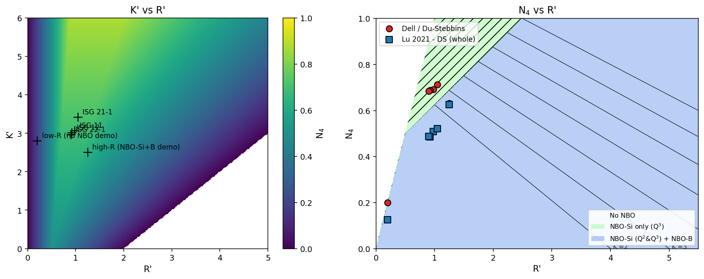

<p align="center"></p>

# DUST

*(the name: a nod to **Du** & **St**ebbins, whose 2005 model this app
is built around - and, fittingly, an app about scattering "dust" of
modifier cations that break a glass network apart into non-bridging
oxygens.)*

A desktop app (PySide6 + matplotlib) that reproduces PhD thesis Figures
4.17 and 5.7 (Soudani, *Manuscrit_THESE_SOUDANI.pdf*) - N4 (fraction of
4-coordinated boron) as a function of glass composition - with a fully
editable R'/K' formula, an editable composition table, CSV import, two
independent N4 models, NBO regime classification, %NBO speciation, and
full plot customization.



## Quick start

```
git clone https://github.com/sams808/DUST.git
cd DUST
powershell -ExecutionPolicy Bypass -File install.ps1
DUST.bat
```

See [docs/INSTALL.md](docs/INSTALL.md) for details/troubleshooting,
[docs/USER_GUIDE.md](docs/USER_GUIDE.md) for a full walkthrough.

## Documentation

| Manual | Covers |
|---|---|
| [docs/INSTALL.md](docs/INSTALL.md) | Setup, updating, running tests, troubleshooting |
| [docs/USER_GUIDE.md](docs/USER_GUIDE.md) | Every tab and button, typical workflows |
| [docs/MODELS_REFERENCE.md](docs/MODELS_REFERENCE.md) | Full formulas, sources, and the calculation-check findings |
| [docs/CUSTOMIZATION.md](docs/CUSTOMIZATION.md) | Field-by-field reference for the R'/K' formula editor and plot appearance |
| [docs/CSV_IMPORT.md](docs/CSV_IMPORT.md) | Data format, column auto-mapping, wt%->mol% conversion |
| [docs/FAQ.md](docs/FAQ.md) | Troubleshooting and common questions |

## What it plots

- **Fig 4.17-style** ("K' vs R'"): K' on the y-axis, R' on the x-axis,
  background colored by the Dell/Du-Stebbins N4(K',R') surface, your
  data points overlaid (optionally colored by any numeric column, e.g.
  Tg or measured N4).
- **Fig 5.7-style** ("N4 vs R'"): N4 on the y-axis, R' on the x-axis,
  background split into the 3 published NBO regimes, iso-K' guide
  lines, and your data points - for any combination of the 5 available
  N4 series (Dell/Du-Stebbins + the 4 Lu et al. 2021 variants), so you
  can compare what different models predict for the same glass.

## Two independent N4 models

1. **Dell (1983) / Du & Stebbins (2005a)** - R'/K' definition is fully
   customizable (which oxides count as formers/modifiers, and their
   weights), because the thesis itself uses different definitions in
   different figures. Also gives the 3-way NBO regime classification
   and %NBO-species speciation (Q3-Si / Q2-Si / B).
2. **Lu et al. (2021)** - 4 fit variants (modified DS / modified
   Bernstein, each whole-database or borosilicate-only), generalized
   multicomponent oxide weighting. N4 only, no NBO speciation.

Full formulas and the calculation-check writeup:
[docs/MODELS_REFERENCE.md](docs/MODELS_REFERENCE.md). Short version:
**both source spreadsheets were checked and found correct** - no
calculation errors, 18 regression tests pin the reference values.

## Repository layout

```
app.py                 entry point (splash screen + main window)
core/                  model math (dell_model.py, lu_model.py), oxide
                        reference data, CSV import (io.py) - no Qt here
gui/                   PySide6 widgets: main_window, table, plots,
                        formula_editor, small reusable widgets
tests/                 pytest regression tests against spreadsheet values
docs/                  manuals (see table above)
bib/                   source papers for both models
sample_data/           example composition CSV loaded at startup
assets/                generated logo/splash/icon (run make_logo.py)
install.ps1/update.ps1 setup scripts; both (re)write DUST.bat
```

## Development

```
py -3.11 -m pytest tests/       # 18 tests, model calculations
py -3.11 make_logo.py           # regenerate assets/ after editing the logo design
py -3.11 app.py                 # run from source
```
